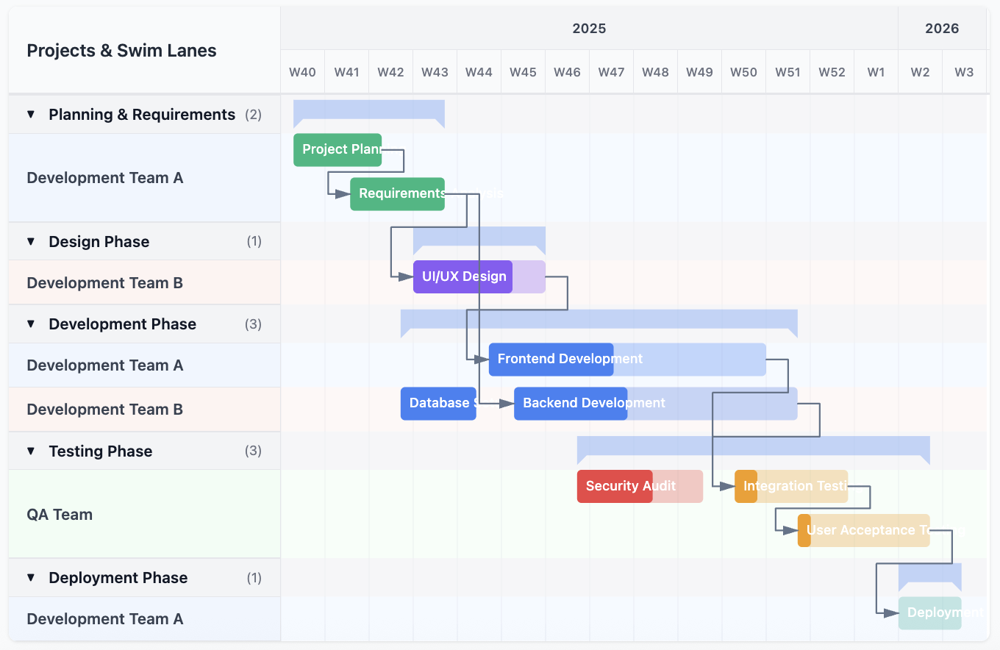

# Vue Simple Gantt



Customizable Vue Gantt chart.


```
npm i @brendanlaschke/vue-simple-gantt
```


## Example

```vue

<script setup>
import { GanttChart } from '@brendanlaschke/vue-simple-gantt'
import { ref } from 'vue'

const options =  {
  viewMode: "day",
  barHeight: 30,
  columnWidth: 40,
  showGrid: true,
  showToday: true,
  dateFormat: "short",
  showDependencies: true,
  barPadding: 4,
  gridColor: "#e5e7eb",
  todayColor: "#ef4444",
  enableProjectGrouping: true,
  projectHeaderHeight: 35,
  milestoneSize: 16,
  showMilestoneLabels: true,
  editDuration: true,
  editPosition: true,
  hideOrphanDependencies: true,
  enableSwimlanes: true,
  showProjectSummary: true,
  showTaskProgress: true,
}

const tasks = ref<GanttTask[]>([
  {
    id: '1',
    name: 'Project Planning',
    start: new Date('2025-10-01'),
    end: new Date('2025-10-15'),
    progress: 100,
    color: '#10b981',
    projectId: 'planning',
    swimlaneId: 'team1'
  },
  {
    id: '2',
    name: 'Requirements Analysis',
    start: new Date('2025-10-10'),
    end: new Date('2025-10-25'),
    progress: 100,
    dependencies: ['1'],
    color: '#10b981',
    projectId: 'planning',
    swimlaneId: 'team1'
  },
  {
    id: '3',
    name: 'UI/UX Design',
    start: new Date('2025-10-20'),
    end: new Date('2025-11-10'),
    progress: 75,
    dependencies: ['2'],
    color: '#8b5cf6',
    projectId: 'design',
    swimlaneId: 'team2'
  },
  {
    id: '4',
    name: 'Frontend Development',
    start: new Date('2025-11-01'),
    end: new Date('2025-12-15'),
    progress: 45,
    dependencies: ['3'],
    color: '#3b82f6',
    projectId: 'development',
    swimlaneId: 'team1'
  },
  {
    id: '5',
    name: 'Backend Development',
    start: new Date('2025-11-05'),
    end: new Date('2025-12-20'),
    progress: 40,
    dependencies: ['2'],
    color: '#3b82f6',
    projectId: 'development',
    swimlaneId: 'team2'
  },
  {
    id: '6',
    name: 'Integration Testing',
    start: new Date('2025-12-10'),
    end: new Date('2025-12-28'),
    progress: 20,
    dependencies: ['4', '5'],
    color: '#f59e0b',
    projectId: 'testing',
    swimlaneId: 'team3'
  },
  {
    id: '7',
    name: 'User Acceptance Testing',
    start: new Date('2025-12-20'),
    end: new Date('2026-01-10'),
    progress: 10,
    dependencies: ['6'],
    color: '#f59e0b',
    projectId: 'testing',
    swimlaneId: 'team3'
  },
  {
    id: '8',
    name: 'Deployment',
    start: new Date('2026-01-05'),
    end: new Date('2026-01-15'),
    progress: 0,
    dependencies: ['7'],
    color: '#14b8a6',
    projectId: 'deployment',
    swimlaneId: 'team1'
  },
  {
    id: '9',
    name: 'Database Setup',
    start: new Date('2025-10-18'),
    end: new Date('2025-10-30'),
    progress: 100,
    color: '#3b82f6',
    projectId: 'development',
    swimlaneId: 'team2'
  },
  {
    id: '10',
    name: 'Security Audit',
    start: new Date('2025-11-15'),
    end: new Date('2025-12-05'),
    progress: 60,
    color: '#ef4444',
    projectId: 'testing',
    swimlaneId: 'team3'
  },
])

// Projects data
const projects = ref<GanttProject[]>([
  {
    id: 'planning',
    name: 'Planning & Requirements',
  },
  {
    id: 'design',
    name: 'Design Phase',
  },
  {
    id: 'development',
    name: 'Development Phase',
  },
  {
    id: 'testing',
    name: 'Testing Phase',
  },
  {
    id: 'deployment',
    name: 'Deployment Phase',
  }
])

// Swim lanes data
const swimlanes = ref<GanttSwimlane[]>([
  {
    id: 'team1',
    name: 'Development Team A',
    color: '#eff6ff'
  },
  {
    id: 'team2',
    name: 'Development Team B',
    color: '#fef3f2'
  },
  {
    id: 'team3',
    name: 'QA Team',
    color: '#f0fdf4'
  }
])
</script>

<template>
    <GanttChart 
        v-model:tasks="tasks" 
        :projects="projects" 
        :swimlanes="swimlanes"
        :options="options"
      />
</template>
```


## License

MIT
