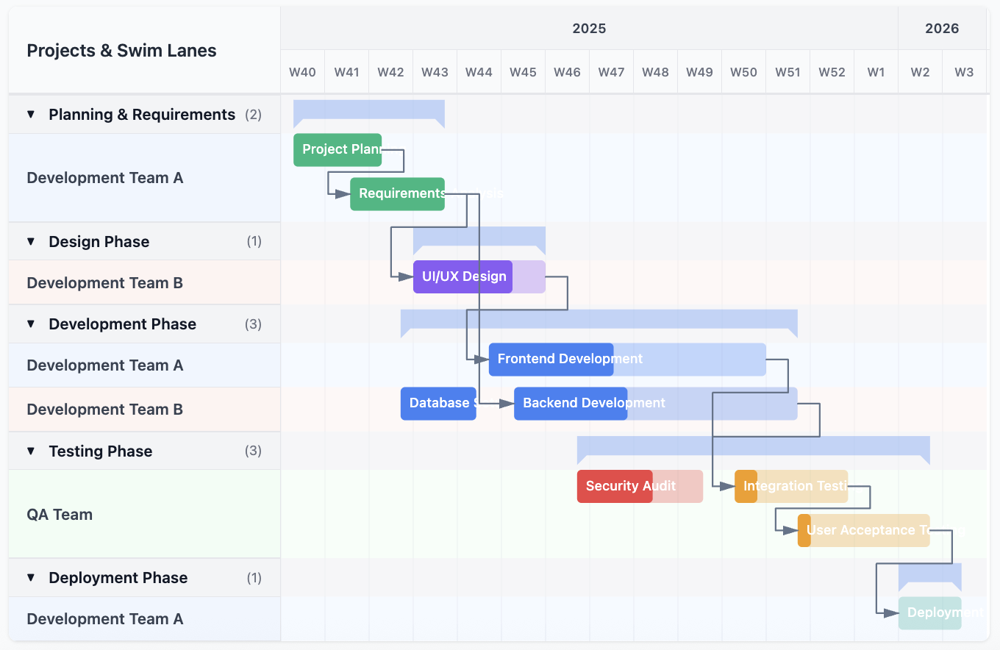

# Vue Simple Gantt



Customizable Vue Gantt chart.

```
npm i @brendanlaschke/vue-simple-gantt
```

## Example

```vue
<script setup>
import { GanttChart } from "@brendanlaschke/vue-simple-gantt";
import { ref } from "vue";

const options = {
  viewMode: "day",
  barHeight: 30,
  columnWidth: 40,
  showGrid: true,
  showToday: true,
  dateFormat: "short",
  showDependencies: true,
  barPadding: 4,
  gridColor: "#e5e7eb",
  todayColor: "#ef4444",
  enableProjectGrouping: true,
  projectHeaderHeight: 35,
  milestoneSize: 16,
  showMilestoneLabels: true,
  showMilestonesInHeader: false,
  milestoneHeaderHeight: 40,
  editDuration: true,
  editPosition: true,
  hideOrphanDependencies: true,
  enableSwimlanes: true,
  showProjectSummary: true,
  showTaskProgress: true,
  sidebarTitle: "Tasks",
  showTooltips: true,
};

const tasks = ref([
  {
    id: "1",
    name: "Project Planning",
    start: new Date("2025-10-01"),
    end: new Date("2025-10-15"),
    progress: 100,
    color: "#10b981",
    projectId: "planning",
    swimlaneId: "team1",
  },
  {
    id: "2",
    name: "Requirements Analysis",
    start: new Date("2025-10-10"),
    end: new Date("2025-10-25"),
    progress: 100,
    dependencies: ["1"],
    color: "#10b981",
    projectId: "planning",
    swimlaneId: "team1",
  },
  {
    id: "3",
    name: "UI/UX Design",
    start: new Date("2025-10-20"),
    end: new Date("2025-11-10"),
    progress: 75,
    dependencies: ["2"],
    color: "#8b5cf6",
    projectId: "design",
    swimlaneId: "team2",
  },
  {
    id: "4",
    name: "Frontend Development",
    start: new Date("2025-11-01"),
    end: new Date("2025-12-15"),
    progress: 45,
    dependencies: ["3"],
    color: "#3b82f6",
    projectId: "development",
    swimlaneId: "team1",
  },
  {
    id: "5",
    name: "Backend Development",
    start: new Date("2025-11-05"),
    end: new Date("2025-12-20"),
    progress: 40,
    dependencies: ["2"],
    color: "#3b82f6",
    projectId: "development",
    swimlaneId: "team2",
  },
  {
    id: "6",
    name: "Integration Testing",
    start: new Date("2025-12-10"),
    end: new Date("2025-12-28"),
    progress: 20,
    dependencies: ["4", "5"],
    color: "#f59e0b",
    projectId: "testing",
    swimlaneId: "team3",
  },
  {
    id: "7",
    name: "User Acceptance Testing",
    start: new Date("2025-12-20"),
    end: new Date("2026-01-10"),
    progress: 10,
    dependencies: ["6"],
    color: "#f59e0b",
    projectId: "testing",
    swimlaneId: "team3",
  },
  {
    id: "8",
    name: "Deployment",
    start: new Date("2026-01-05"),
    end: new Date("2026-01-15"),
    progress: 0,
    dependencies: ["7"],
    color: "#14b8a6",
    projectId: "deployment",
    swimlaneId: "team1",
  },
]);

const milestones = ref([
  {
    id: "m1",
    name: "Design Complete",
    date: new Date("2025-11-10"),
    color: "#8b5cf6",
    projectId: "design",
  },
  {
    id: "m2",
    name: "Launch",
    date: new Date("2026-01-15"),
    color: "#ef4444",
    dependencies: ["8"],
  },
]);

const projects = ref([
  {
    id: "planning",
    name: "Planning & Requirements",
    color: "#10b981",
    progress: 100,
  },
  {
    id: "design",
    name: "Design Phase",
    color: "#8b5cf6",
    progress: 75,
  },
  {
    id: "development",
    name: "Development Phase",
    color: "#3b82f6",
    progress: 42,
  },
  {
    id: "testing",
    name: "Testing Phase",
    color: "#f59e0b",
    progress: 15,
  },
  {
    id: "deployment",
    name: "Deployment Phase",
    color: "#14b8a6",
    progress: 0,
  },
]);

const swimlanes = ref([
  { id: "team1", name: "Development Team A", color: "#eff6ff" },
  { id: "team2", name: "Development Team B", color: "#fef3f2" },
  { id: "team3", name: "QA Team", color: "#f0fdf4" },
]);
</script>

<template>
  <GanttChart
    v-model:tasks="tasks"
    :milestones="milestones"
    :projects="projects"
    :swimlanes="swimlanes"
    :options="options"
    @click="(event, type, data) => console.log(type, data)"
    @task:move="(id, start, end) => console.log('moved', id)"
    @task:resize="(id, start, end) => console.log('resized', id)"
  />
</template>
```

## Props

| Prop         | Type               | Default  | Description                                                                  |
| ------------ | ------------------ | -------- | ---------------------------------------------------------------------------- |
| `tasks`      | `GanttTask[]`      | required | Array of tasks to display. Supports `v-model:tasks` for drag/resize updates. |
| `milestones` | `GanttMilestone[]` | `[]`     | Array of milestone markers.                                                  |
| `projects`   | `GanttProject[]`   | `[]`     | Array of projects used for grouping tasks.                                   |
| `swimlanes`  | `GanttSwimlane[]`  | `[]`     | Array of swim lanes used to group tasks horizontally.                        |
| `options`    | `GanttOptions`     | `{}`     | Chart configuration options (see below).                                     |

## Events

| Event          | Payload                                                                                          | Description                                                                                                  |
| -------------- | ------------------------------------------------------------------------------------------------ | ------------------------------------------------------------------------------------------------------------ |
| `update:tasks` | `GanttTask[]`                                                                                    | Emitted after a task is moved or resized (use with `v-model:tasks`).                                         |
| `task:update`  | `(taskId: string, updates: { start?: Date; end?: Date })`                                        | Emitted after any task date change.                                                                          |
| `task:move`    | `(taskId: string, start: Date, end: Date)`                                                       | Emitted specifically when a task is dragged.                                                                 |
| `task:resize`  | `(taskId: string, start: Date, end: Date)`                                                       | Emitted specifically when a task is resized.                                                                 |
| `click`        | `(event: MouseEvent, type: 'task' \| 'summary' \| 'milestone' \| 'project' \| 'swimlane', data)` | Emitted when the user clicks a task bar, project summary bar, milestone, project header, or swim lane label. |

## GanttTask

| Property       | Type                      | Required | Description                                                                                      |
| -------------- | ------------------------- | -------- | ------------------------------------------------------------------------------------------------ |
| `id`           | `string`                  | ✓        | Unique identifier.                                                                               |
| `name`         | `string`                  | ✓        | Display label shown on the bar.                                                                  |
| `start`        | `Date`                    | ✓        | Start date/time of the task.                                                                     |
| `end`          | `Date`                    | ✓        | End date/time of the task.                                                                       |
| `progress`     | `number`                  | ✓        | Completion percentage (0–100). Rendered as a fill inside the bar.                                |
| `color`        | `string`                  |          | CSS color for the task bar. Defaults to `#3b82f6`.                                               |
| `dependencies` | `string[]`                |          | IDs of tasks this task depends on. Renders dependency arrows when `showDependencies` is enabled. |
| `projectId`    | `string`                  |          | ID of the project this task belongs to (requires `enableProjectGrouping`).                       |
| `swimlaneId`   | `string`                  |          | ID of the swim lane this task belongs to (requires `enableSwimlanes`).                           |
| `isMilestone`  | `boolean`                 |          | Renders the task as a diamond milestone instead of a bar.                                        |
| `metadata`     | `Record<string, unknown>` |          | Arbitrary data passed through to click events.                                                   |

## GanttMilestone

| Property       | Type                      | Required | Description                                                                                       |
| -------------- | ------------------------- | -------- | ------------------------------------------------------------------------------------------------- |
| `id`           | `string`                  | ✓        | Unique identifier.                                                                                |
| `name`         | `string`                  | ✓        | Label shown next to the diamond when `showMilestoneLabels` is enabled.                            |
| `date`         | `Date`                    | ✓        | Date of the milestone. Also expands the chart date range so the milestone is always visible.      |
| `color`        | `string`                  |          | CSS color for the diamond. Defaults to `#3b82f6`.                                                 |
| `projectId`    | `string`                  |          | ID of the project this milestone belongs to. The milestone is rendered on the project header row. |
| `dependencies` | `string[]`                |          | IDs of tasks or milestones this milestone depends on.                                             |
| `metadata`     | `Record<string, unknown>` |          | Arbitrary data passed through to click events.                                                    |

## GanttProject

| Property   | Type                      | Required | Description                                                                                                |
| ---------- | ------------------------- | -------- | ---------------------------------------------------------------------------------------------------------- |
| `id`       | `string`                  | ✓        | Unique identifier. Referenced by `GanttTask.projectId` and `GanttMilestone.projectId`.                     |
| `name`     | `string`                  | ✓        | Display name shown in the project header row.                                                              |
| `color`    | `string`                  |          | CSS color for the project summary bar. Defaults to `#3b82f6`.                                              |
| `progress` | `number`                  |          | Completion percentage (0–100) shown as a progress fill on the summary bar (requires `showProjectSummary`). |
| `metadata` | `Record<string, unknown>` |          | Arbitrary data passed through to click events.                                                             |

## GanttSwimlane

| Property   | Type                      | Required | Description                                              |
| ---------- | ------------------------- | -------- | -------------------------------------------------------- |
| `id`       | `string`                  | ✓        | Unique identifier. Referenced by `GanttTask.swimlaneId`. |
| `name`     | `string`                  | ✓        | Display name shown in the swim lane label.               |
| `color`    | `string`                  |          | Background color for the swim lane row.                  |
| `metadata` | `Record<string, unknown>` |          | Arbitrary data passed through to click events.           |

## GanttOptions

| Option                       | Type                                                                   | Default     | Description                                                                                                                            |
| ---------------------------- | ---------------------------------------------------------------------- | ----------- | -------------------------------------------------------------------------------------------------------------------------------------- |
| `viewMode`                   | `'10min' \| '15min' \| 'hour' \| 'day' \| 'week' \| 'month' \| 'year'` | `'day'`     | Time scale granularity of the timeline header and column grid.                                                                         |
| `barHeight`                  | `number`                                                               | `30`        | Height of task bars in pixels.                                                                                                         |
| `columnWidth`                | `number`                                                               | `40`        | Width of a single time column in pixels.                                                                                               |
| `barPadding`                 | `number`                                                               | `4`         | Vertical gap between task bars in pixels.                                                                                              |
| `showGrid`                   | `boolean`                                                              | `true`      | Whether to render vertical grid lines.                                                                                                 |
| `showToday`                  | `boolean`                                                              | `true`      | Whether to highlight today's date with a vertical indicator line.                                                                      |
| `todayColor`                 | `string`                                                               | `'#ef4444'` | Color of the today indicator line.                                                                                                     |
| `gridColor`                  | `string`                                                               | `'#e5e7eb'` | Color of the grid lines.                                                                                                               |
| `dateFormat`                 | `string`                                                               |             | Custom date format string for the timeline header labels.                                                                              |
| `showDependencies`           | `boolean`                                                              | `true`      | Whether to draw arrows between dependent tasks/milestones.                                                                             |
| `hideOrphanDependencies`     | `boolean`                                                              | `false`     | Hide dependency arrows whose source or target task is inside a collapsed project.                                                      |
| `enableProjectGrouping`      | `boolean`                                                              | `false`     | Group tasks under collapsible project header rows.                                                                                     |
| `projectHeaderHeight`        | `number`                                                               | `35`        | Height of each project header row in pixels.                                                                                           |
| `showProjectSummary`         | `boolean`                                                              | `false`     | Render a summary bar spanning the project's task date range on the project header row.                                                 |
| `enableSwimlanes`            | `boolean`                                                              | `false`     | Group tasks into horizontal swim lane sections. Overlapping tasks are packed into multiple rows automatically.                         |
| `milestoneSize`              | `number`                                                               | `16`        | Diameter of milestone diamonds in pixels.                                                                                              |
| `showMilestoneLabels`        | `boolean`                                                              | `false`     | Show milestone name labels next to the diamonds.                                                                                       |
| `showMilestonesInHeader`     | `boolean`                                                              | `false`     | Display all milestones in a dedicated row pinned below the timeline header instead of inline.                                          |
| `milestoneHeaderHeight`      | `number`                                                               | `40`        | Height of the milestone header row in pixels (only used when `showMilestonesInHeader` is `true`).                                      |
| `editDuration`               | `boolean`                                                              | `false`     | Allow resizing task bars to change their duration.                                                                                     |
| `editPosition`               | `boolean`                                                              | `false`     | Allow dragging task bars to change their start/end dates.                                                                              |
| `showTaskProgress`           | `boolean`                                                              | `false`     | Show the progress percentage as text inside task bars.                                                                                 |
| `showTooltips`               | `boolean`                                                              | `false`     | Show a tooltip with the full task name on hover (useful when the bar is too narrow for the label).                                     |
| `sidebarTitle`               | `string`                                                               | `''`        | Custom title displayed at the top of the sidebar column.                                                                               |
| `showCollapseExpandAll`      | `boolean`                                                              | `false`     | Show a collapse all / expand all toggle button (⊟/⊞) in the sidebar header. Only has an effect when `enableProjectGrouping` is `true`. |
| `projectsCollapsedByDefault` | `boolean`                                                              | `false`     | When `true`, all projects start in the collapsed state. Requires `enableProjectGrouping: true`.                                        |

## License

MIT
